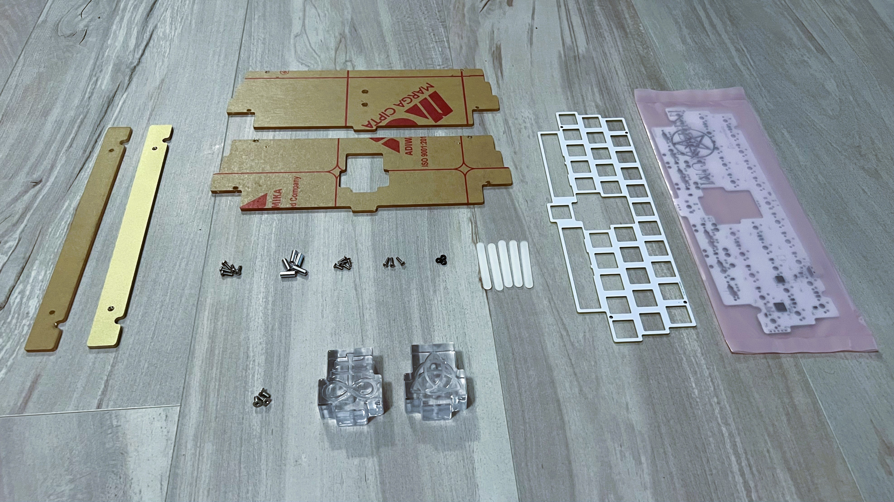
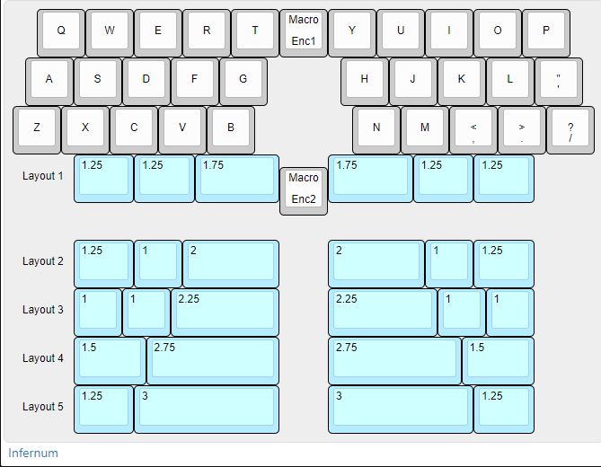
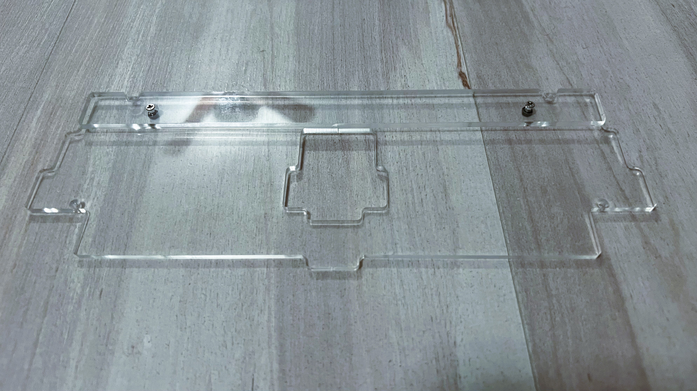
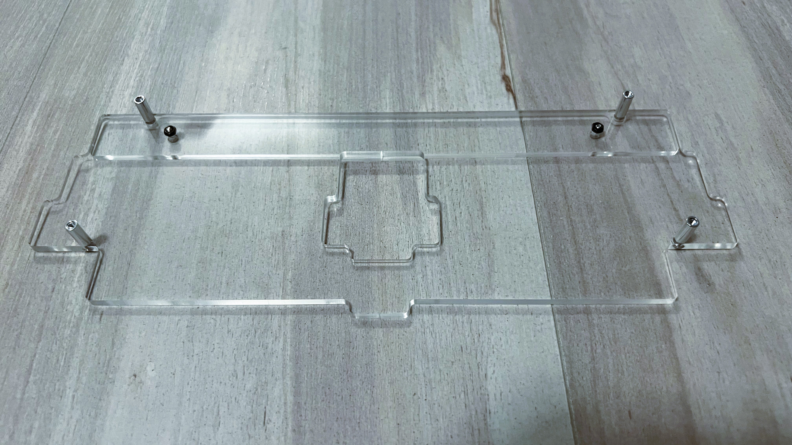
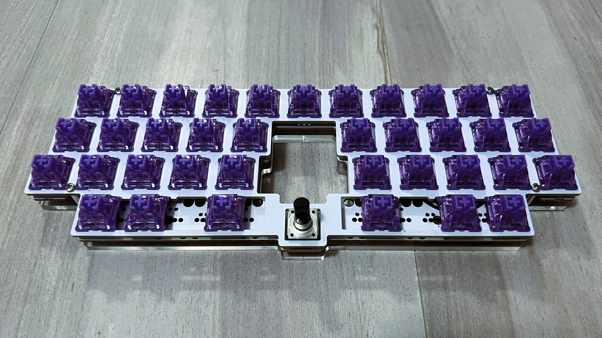
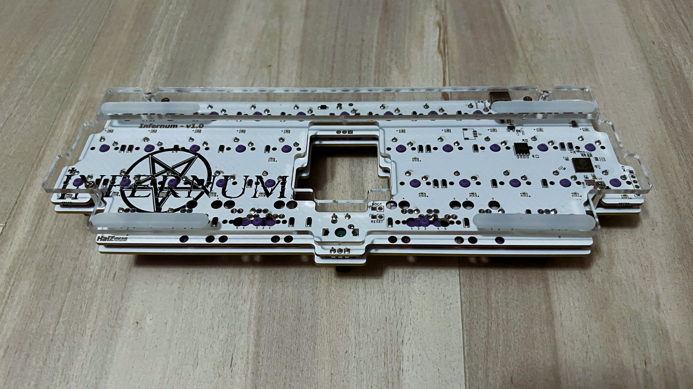
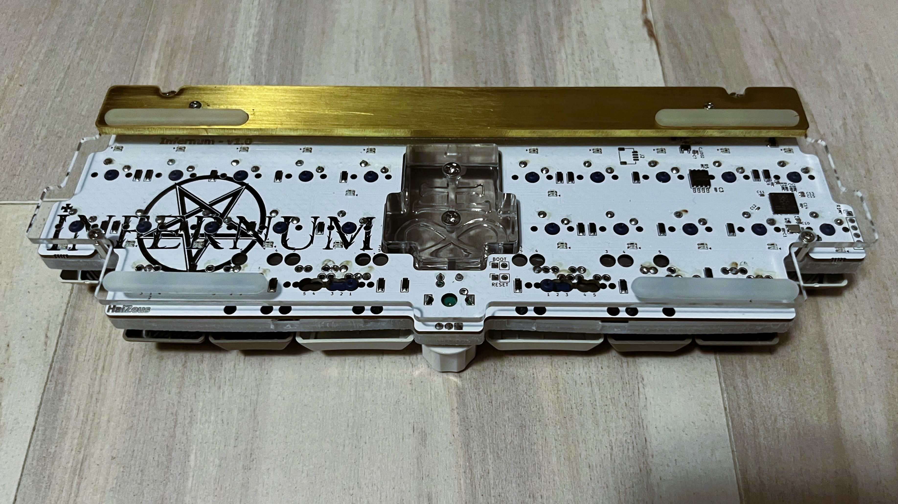
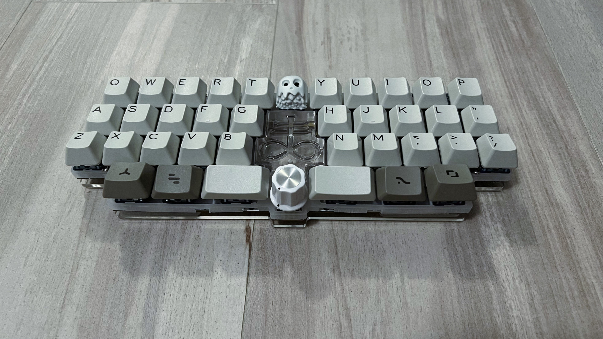

# Infernum Build Guide
Each Infernum Skeleton Kit will come with the following items:
 - 1x PCB in anti-static wrapping
 - 1x FR4 switch plate
 - 1x Acrylic bottom plate (blocker or blocker-less)
 - 1x Foot (acrylic or brass)

Hardware:
 - 5x M2x6mm round head screws
 - 5x M2x10mm standoffs
 - 5x M2x6mm counter sunk screws
 - 3x M2x8mm counter sunk screws
 - 3x M2 hex nuts
 - 5x Silicone feet

Blocker variant will also include:
 - Choice of blocker
 - 3x M3x6mm counter sunk screws

 

PCBs have been tested before shipping, however, it is always best to test a PCB before soldering as a precaution. If you are using encoders and/or stabilizers, make sure to install them before soldering on switches, as it will not be possible afterwards. Please reference the layout numbering in the below KLE when soldering the space bar switches. The layouts are numbered below each switch position on the PCB.

 

This skeleton kit is the same as most other skeleton kits, with the distinguishing factor being the use of countersunk screws. All counter sunk screws are to be used on the bottom side of the acrylic bottom plate and foot. The photos below depict each step in the assembly process.

Step 1 (Optional): If typing angle is desired, attach foot to bottom plate using M2x8mm counter sunk screws and M2 hex nuts. Counter sunk holes on foot and bottom plate must be facing the same direction.
 

Step 2: Attach standoffs to bottom plate using M2x6mm counter sunk screws. Please note, foot should be on the opposite side of the standoffs.
 

Step 3: Attach PCB-switch plate assembly to bottom plate using M2x6mm round head screws. 
 

Step 4: Attach silicone feet to bottom side.
 

Step 5 (Blocker only): Attach blocker to bottom plate using M3x6mm counter sunk screws.

Step 6: Add keycaps and enjoy!
 
